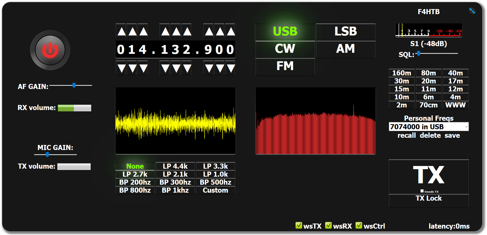

# Universal_HamRadio_Remote_HTML5
Universal HamRadio Remote HTML5 interface. 
This is an implementation of python server and html5 function to get an webbrowsable interface to use your TRX in RX and TX. 
You can use basis and some advanced functions of your radio.
You use your speaker and microphone of your computer to communication.
This project is more oriented for speaking or CW.
 

This utility is used to set up an amateur radio station remotely via a web browser.

You need:
- a radio station compatible with Hamlib.
- a cat interface.
- a circuit making it possible to adapt the audio levels between the microphone input, the speaker output and the sound card.

Assuming your raspberry pi hostname is set to UHRR, you can access it at https://UHRR.local:8888/
Note the HTTP <b> S </b>.
You can configure all of this by logging into https://UHRR.local:8888/CONFIG
If the original configuration is not good, this will automatically switch to the configuration page.

Here are some pictures concerning the implementation:

Requirements:

sudo apt-get install -y git python3 python3-pip3 python3-libhamlib2 python3-numpy python3-tornado python3-serial python3-pyaudio 
sudo pip3 install pyalsaaudio 

Installation:

cd ~/ 
git clone https://github.com/F4HTB/Universal_HamRadio_Remote_HTML5.git 
cd Universal_HamRadio_Remote_HTML5 
sudo cp selfsign.crt /boot/UHRH.crt
sudo cp selfsign.key /boot/UHRH.key
./UHRR 

Optional:

sudo apt-get install screen 

add in /etc/rc.local the command to run at startup: 

sudo nano /etc/rc.local 
copy and past: runuser -l pi -c '(cd /home/pi/Universal_HamRadio_Remote_HTML5/ && ./UHRR >> /tmp/uhrr.log) &' 
 
 

 
[SERVER] 
SERVER port: the server port 
 
[AUDIO] 
AUDIO outputdevice: output from audio soundcard to the mic input of TRX 
AUDIO inputdevice: int from audio soundcard from the speaker output of TRX 
 
[HAMLIB] 
HAMLIB com port: com port of the car interface 
HAMLIB radio model: hamlib trx model 
HAMLIB auto tx poweroff: set if auto off the trx when it's not used 
 
Possible problem:No //is for get some problemes from the code 
 
 
Other optional to get more function is use Hamlib last version: 
 
git clone https://github.com/Hamlib/Hamlib 
cd Hamlib 
./bootstrap 
./configure --with-python-binding PYTHON=$(which python3) 
make 
sudo make install 
cd bindings 
make 
sudo make install 
 
Special thanks to Mike W9MDB! and all the hamlib team for all the staf 
